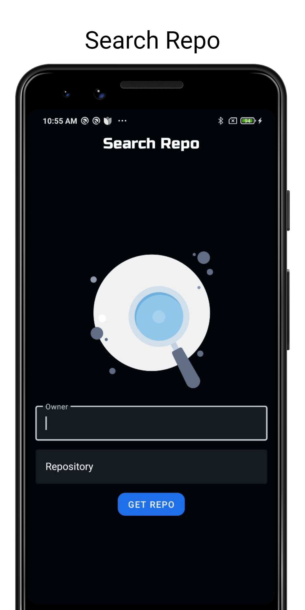
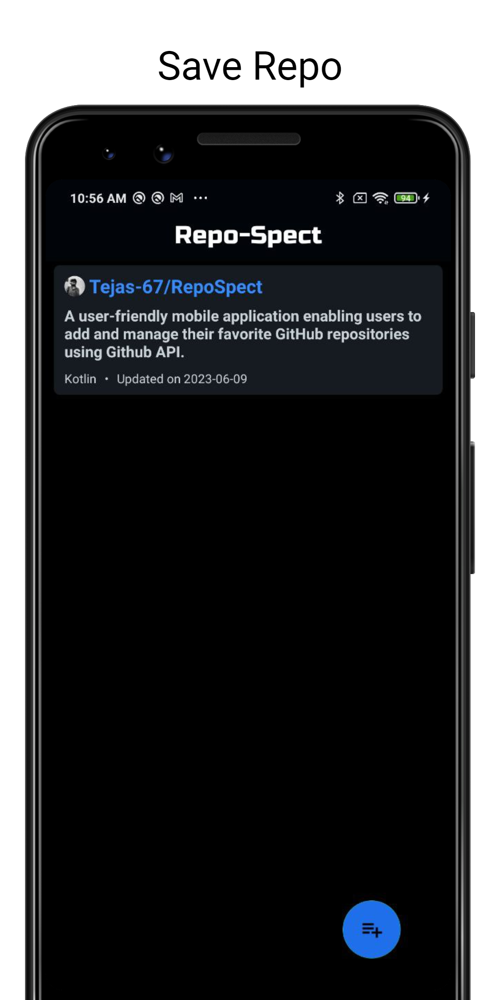
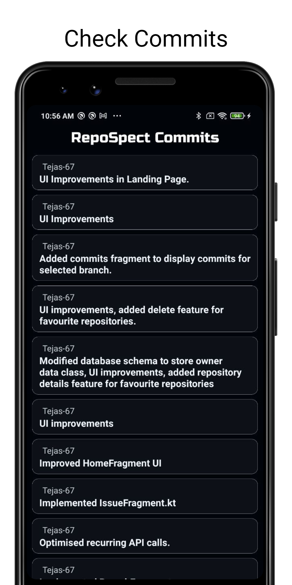

# RepoSpect
## Overview
A user-friendly native android application enabling users to add and manage their favorite repositories using Github API.
## Features
* Track your favourite repositories
* View commits, issues and branches
* Search your favourite repo
* Save you favourite repo
## Screenshots

## Tech Stack Used
* Kotlin
* XML
* Lottie Animations
* Github API
## Use this application
* Click here to download the [APK](https://drive.google.com/file/d/1bUuQEF9UJx2yfx0OauTxZRmrDIEHyqjV/view?usp=drive_link)
* Or clone the repository into your computer to see the code and build the APK.
